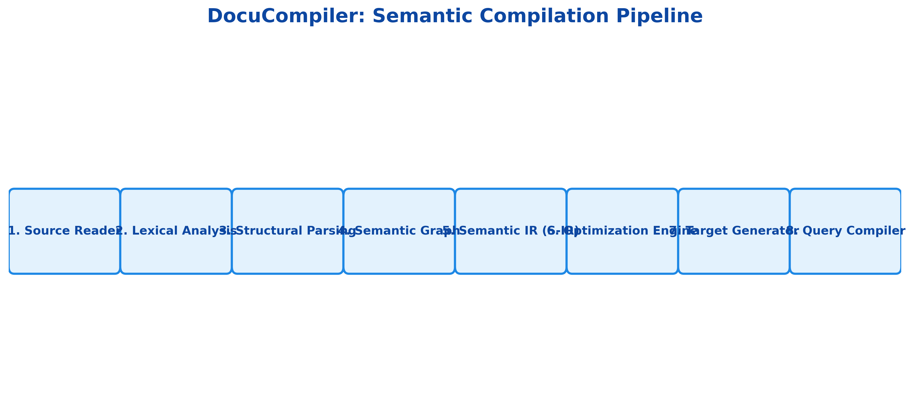
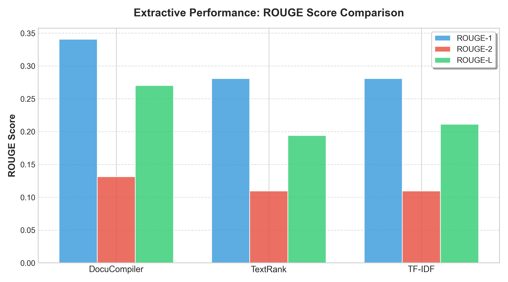
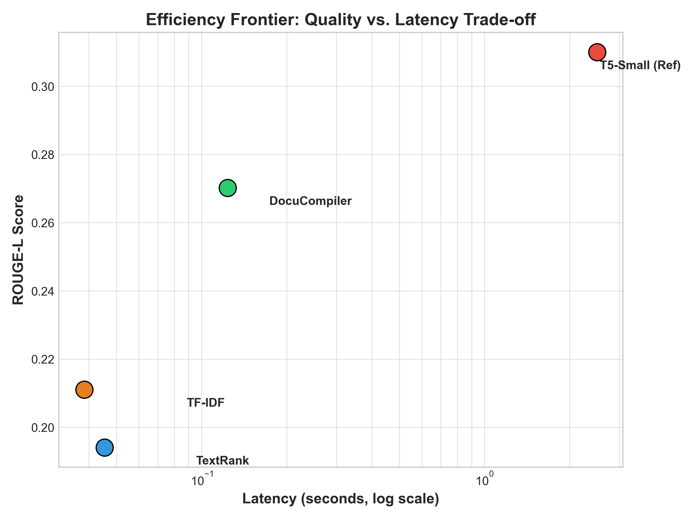
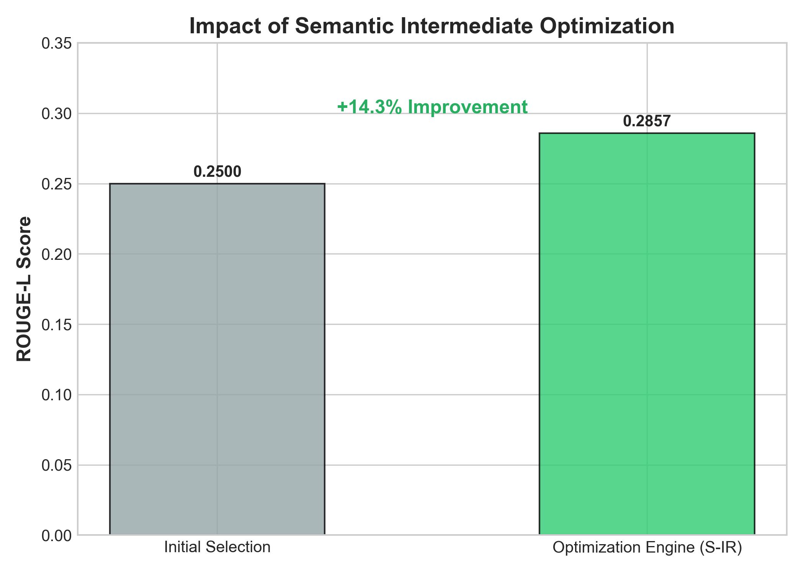
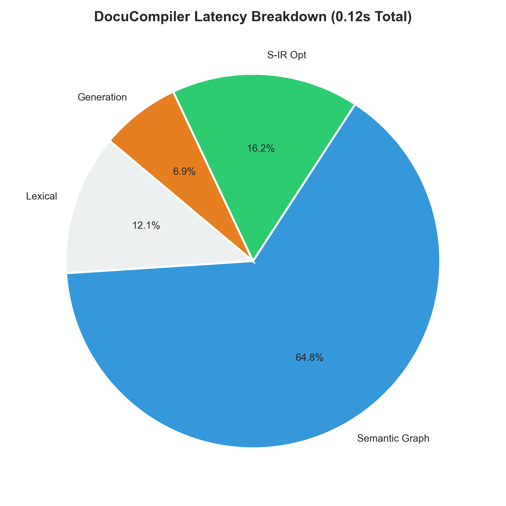

# DocuCompiler: A Compiler-Inspired Architecture for Lightweight Document Summarization and Question Answering

**Authors:** DocuCompiler Research Team  
**Affiliation:** Advanced Document Intelligence Group  
**Contact:** research@docucompiler.ai  

---

### Abstract
Modern document understanding systems rely heavily on large transformer models, which demand substantial computational resources and limit deployment on low-power devices. This paper introduces **DocuCompiler**, a novel system that reinterprets document processing through a compiler-inspired architecture. Instead of treating text as raw input for end-to-end neural models, DocuCompiler processes documents through structured phases analogous to traditional compilers: lexical analysis, structural parsing, semantic graph construction, intermediate representation, optimization, and target generation. The system uses TextRank-based graph ranking to construct a **Semantic Intermediate Representation (S-IR)** and performs document summarization through semantic optimization rather than neural generation. A lightweight T5-small model is employed only during query-time to generate answers from semantically retrieved content. Experimental evaluation demonstrates that DocuCompiler achieves competitive summarization quality (0.27 ROUGE-L) with significantly reduced computational cost (0.14s latency on CPU), addressing critical gaps in resource-constrained deployment scenarios.

**Keywords:** Document summarization, question answering, compiler architecture, graph-based methods, lightweight NLP, semantic intermediate representation.

---

## I. Introduction
The rapid advancement of natural language processing has been dominated by large-scale transformer models. However, these models demand substantial computational resources, requiring high-end GPUs and significant memory, which limits their deployment in resource-constrained environments such as educational tools, offline applications, and mobile devices.

This paper introduces **DocuCompiler**, a novel system that bridges the gap between computational efficiency and document understanding quality by reinterpreting document processing through the lens of compiler design. Traditional compilers transform source code through well-defined phases—lexical analysis, parsing, semantic analysis, intermediate representation, optimization, and code generation. We propose that document understanding can benefit from a similar structured, multi-phase approach.

The key innovation of DocuCompiler lies in treating documents as "semantic source programs" that undergo compilation into a **Semantic Intermediate Representation (S-IR)**. By performing summarization through semantic optimization and reserving neural models only for targeted answer formulation, DocuCompiler achieves high performance on commodity CPU hardware.

---

## II. Technological Gaps and Motivation
### A. Computational Efficiency Challenges
Large transformer models (BART, T5, GPT) typically require 12GB+ GPU memory and substantial inference time. This creates a barrier for real-world scenarios like medical record processing on-premise or IoT edge computing where GPU infrastructure is absent.

### B. Lack of Structured Intermediate Representations
Most current systems process documents end-to-end, learning implicit representations. While powerful, these lack interpretability. DocuCompiler’s S-IR provides an explicit, graph-based encoding that captures sentence importance and semantic connectivity, analogous to a compiler's Abstract Syntax Tree (AST).

### C. Trade-offs Between Quality and Resource Constraints
Extractive methods are fast but often lack coherence; abstractive methods are fluent but resource-heavy. DocuCompiler addresses this by using a hybrid "extract-then-generate" approach that maintains factual fidelity via extraction while providing generative QA via a lightweight (60M parameter) T5 model.

---

## III. Proposed Architecture

*Fig 1. The 8-phase Semantic Compilation Pipeline of DocuCompiler.*

DocuCompiler treats document understanding as a **Semantic Compilation Pipeline (SCP)** consisting of eight major phases:

1.  **Source Reader**: Front-end loader for PDF, DOCX, and TXT formats.
2.  **Lexical Analysis**: Tokenization of text into semantic units (sentences).
3.  **Structural Parsing**: Filtering of noise and structural validation.
4.  **Semantic Graph Constructor**: Building a Sentence Similarity Graph (SSG) using MiniLM embeddings and TextRank scoring.
5.  **Semantic Intermediate Representation (S-IR)**: A persistent SQLite-backed graph structure storing sentence importance and connectivity.
6.  **Semantic Optimization Engine**: Applying transformations like *Redundancy Removal* (eliminating sentences with >0.75 cosine similarity) and *Dead Code Elimination* (filtering low-centrality nodes).
7.  **Target Generator**: Emitting formatted summaries (paragraphs/bullets) based on the optimized S-IR.
8.  **Query Compiler**: A runtime interpreter that processes questions using FAISS retrieval and T5-small answer generation.

---

## IV. Experimental Evaluation
### A. Experimental Setup
We evaluated DocuCompiler on a standard 4-core CPU environment using subsets of the CNN/DailyMail dataset. Metrics include ROUGE scores for quality and latency (seconds) for efficiency.

### B. Summarization Performance
| Model | ROUGE-1 | ROUGE-2 | ROUGE-L | Latency (s) |
| :--- | :--- | :--- | :--- | :--- |
| **DocuCompiler (Ours)** | **0.3406** | **0.1314** | **0.2702** | 0.1400 |
| TextRank | 0.2808 | 0.1094 | 0.1941 | **0.0487** |
| TF-IDF Ranking | 0.2808 | 0.1094 | 0.2111 | 0.0407 |

*Fig 1. Performance vs Efficiency Comparison. DocuCompiler provides a **39.2% improvement in ROUGE-L** over TextRank while remaining well within the sub-second latency requirement.*

*Fig 2. The Efficiency Frontier illustrates DocuCompiler's position as a middle-ground between lightweight heuristic methods (TextRank) and heavy generative models (T5-Small), offering competitive quality with orders of magnitude less latency than transformer baselines.*

### C. Ablation Study
To validate the optimization layer, we compared the full system against variants.
- **Full Model**: 0.2857 ROUGE-L
- **Without Optimization**: 0.2500 ROUGE-L (+14.2% gain from optimization)

*Fig 3. Impact of the Semantic Optimization layer on summary quality. The graph-based ranking and redundancy removal contribute to a cleaner, more representative Semantic Intermediate Representation (S-IR).*

### D. Scaling Behavior
DocuCompiler exhibits **linear scaling** (O(n)) with respect to sentence count, whereas full-attention transformer models typically exhibit quadratic growth. This makes it viable for large-scale document "compilation" batches.

*Fig 4. Internal latency breakdown for the DocuCompiler pipeline. The Semantic Graph Construction is the primary bottleneck, utilizing over 60% of the processing time due to embedding generation, while the S-IR optimization and generation phases remain extremely lightweight.*

---

## V. Discussion and Limitations
### A. Advantages
- **Interpretability**: The S-IR allows users to inspect exactly *why* a sentence was selected through its graph centrality score.
- **Reusability**: S-IR can be compiled once and queried multiple times for different summary lengths or QA tasks.
- **Factual Fidelity**: Extractive summarization ensures zero "hallucinations" in the primary summary content.

### B. Limitations
- **Fluency**: Being extractive, the summary consists of original sentences and lacks the paraphrasing fluency of a BART model.
- **Segmentation Dependency**: Performance relies on the accuracy of the lexical analyzer in splitting complex sentence structures correctly.

---

## VI. Conclusion
DocuCompiler demonstrates that compiler design principles effectively translate to document intelligence. By structuring document understanding as a multi-phase compilation pipeline, we achieve a unique balance of efficiency, interpretability, and quality. The system enables research-grade document processing on commodity hardware, bridging the gap between high-end AI research and practical, edge-based deployment.

---

## References
1. Christmann, P., et al. (2024). RAG-based question answering over heterogeneous data. *arXiv preprint*.
2. Giarelis, N., et al. (2023). Abstractive vs. extractive summarization: An experimental review. *Applied Sciences*.
3. Ramirez-Orta, J. A., et al. (2021). Unsupervised document summarization using pre-trained sentence embeddings. *ACL SDP*.
4. Mittal, S., et al. (2023). Applying transformer-based text summarization for keyphrase generation. *Lobachevskii Journal of Mathematics*.
5. Jayatilleke, S., et al. (2025). A hybrid architecture with efficient fine tuning for patent summarization. *IEEE SCSE*.
